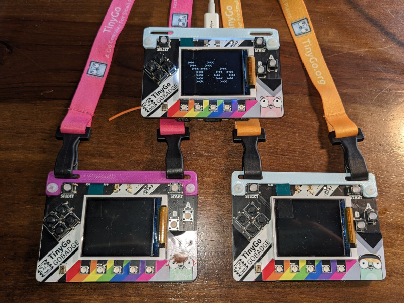
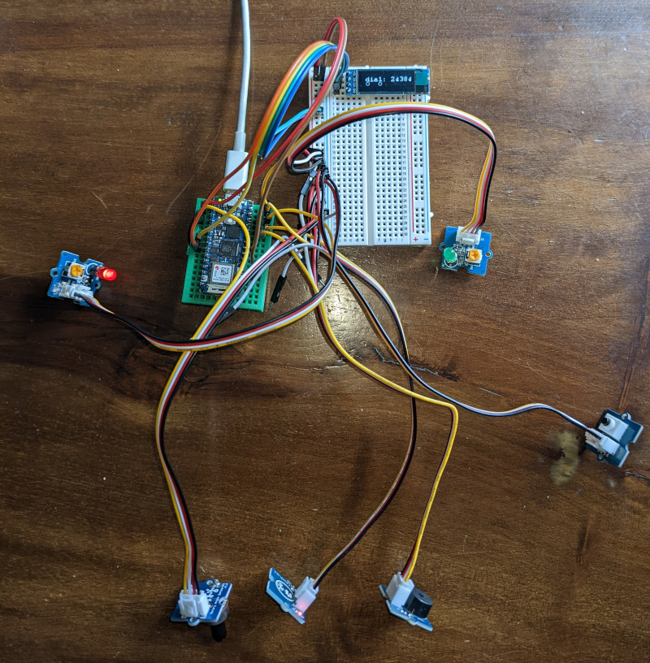

# Gophercon 2023


The is the repository for the hardware hack session at Gophercon 2023.

https://gophercon.com/

### If you received a GoBadge, it is yours to keep. Please return all other equipment when you are finished for the next person. Thank you!

## Installation

### Clone this repo

First use git to clone this repo to your local machine:

```
git clone https://github.com/hybridgroup/gophercon-2023.git
cd gophercon-2023
```

### Install Go 1.21

If somehow you have not installed Go 1.21 on your computer already, you can download it here:

https://go.dev/dl/

Now you are ready to install TinyGo.

### Install TinyGo

You will need to install TinyGo 0.29.0 in order to do today's activities.

https://tinygo.org/getting-started/install/

## Activities

### GoBadge Hacking



If you are one of the very fortunate individuals to have received a GoBadge, it is in fact yours to keep!

Go to https://github.com/tinygo-org/gobadge for more info.

### TinyGo IoT sensors



Looking for the true "parts experience"? Got you covered! We have brought some Arduino Nano RP2040 Connect IoT microcontroller boards for each person to use for the activity.

https://store.arduino.cc/collections/boards/products/arduino-nano-rp2040-connect

These can be programmed using TinyGo.

There are some Grove sensor kits that you can use for the activity.

Ready to try this out? Go to [./sensor/arduino/](./sensor/arduino/) to get started.

### Gopherdrones

#### DJI Tello


We have brought some DJI Tello drones for your Go-powered flying activities.

In additional to the drones to be to be coded/flown, we also have Dualshock3-clone controllers for flight control. Post your awesome videos using hashtag #gophercon

Want to get airborne? Go to [./drone/tello/](./drone/tello/).

#### Parrot Minidrones


We have Parrot Minidrones you can fly with Go code to control them using their built-in Bluetooth API.

Post in-flight videos using hashtag #gophercon

Ready for takeoff? Go to [./drone/minidrone/](./drone/minidrone/).

### TinyGo Music Jam


Make your own electronic musical instruments using TinyGo and the Raspberry Pi Nano boards.

Thanks to the USB-MIDI support, you can turn your board into a tiny digital musical instrument controller.

Add buttons, sliders, a joystick, and when we say become part of the music we mean it!

Let's make beautiful music together, just go to [./musicjam/](./musicjam/).

### Sphero Ollie robots


Turns out we had a few unopened Sphero Ollie robots that we found just in time for Gophercon! These fast Bluetooth controlled robotic toys have long been a Go programmer fan favorite.

There are a few of these cylindrical robots to help satisfy your need for speed.

Want to take one for a spin? Go to [./robot/sphero/](./robot/sphero/).

## Bounties

We have some other cool giveaways as bounties and prizes.

### Xiao ESP32-C3

We have 2 Xiao ESP32-C3 development boards, a new RISCV microcontroller with onboard WiFi. We need help adding the code to support the built-in serial interface.

### Raspberry Pi Pico W

We've got 2 Raspberry Pi Pico W boards, the board using the RP2040 microcontroller with an onboard WiFi chip.

### Sphero Ollie

Take home your very own Sphero Ollie high speed Bluetooth controlled robot. All you need to do is help us implement the calibration code.

The JS library shows what needs to be done:
https://github.com/sphero-inc/sphero.js/blob/master/lib/devices/custom.js#L288-L343

Submit a PR adding the needed code to https://github.com/hybridgroup/gobot/blob/dev/platforms/sphero/sphero_driver.go and claim it! 

## License

Copyright (c) 2015-2023 The Hybrid Group and friends. Licensed under the MIT license.
