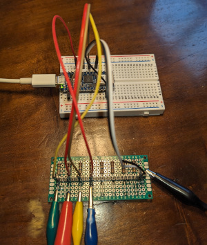

# TinyGo Music Jam

Make music using your own Arduino-based customized MIDI controller using audio software running on your notebook computer.

```
┌────────────────────────────┐      ┌────────────────────────────────────────────────┐
│                            │      │                                                │
│ ┌────────────────────────┐ │      │ ┌──────────────────────┐                       │
│ │                        │ │      │ │                      │                       │
│ │                        │ │      │ │                      │                       │
│ │     MIDI Controller    │ │      │ │       USB-MIDI       │                       │
│ │                        ├─┼──────┼─►                      │                       │
│ │                        │ │      │ │                      │                       │
│ │                        │ │      │ │                      │                       │
│ │                        │ │      │ │                      │                       │
│ │                        │ │      │ │                      │                       │
│ └────────────────────────┘ │      │ └──────────┬───────────┘                       │
│                            │      │            │                                   │
│                            │      │            │                                   │
│                            │      │            │                                   │
│                            │      │            │                                   │
│                            │      │            │                                   │
│                            │      │ ┌──────────▼───────────┐                       │
│                            │      │ │                      ├─────────────────────┐ │
│                            │      │ │                      │                     │ │
│                            │      │ │     Web MIDI API     │ Web Software Synth  │ │
│                            │      │ │                      │                     │ │
│                            │      │ │                      ├─────────────────────┘ │
│                            │      │ │                      │                       │
│                            │      │ │                      │                       │
│                            │      │ │                      │                       │
│                            │      │ └──────────────────────┘                       │
│                            │      │                                                │
└────────────────────────────┘      └────────────────────────────────────────────────┘

  Arduino                             Computer

```

Thanks to USB-MIDI standard, the Arduino will appear as a standard MIDI controller. You can use it to connect to online instruments that use the Web MIDI API.


## Online Synths and Instruments

This is just a list of a few of the available online synths and other virtual instruments.

https://midi.city/

https://www.websynths.com/microtonal/

https://www.gsn-lib.org/apps/cardboardsynth/index.html

https://www.webaudiomodules.org/wamsynths/webcz101/

https://juno-106.js.org/

https://virtualpiano.eu/

https://experiments.withgoogle.com/ai/sound-maker/view/

## Controller



The MIDI Controller is intended to run directly on Arduino to send MIDI commands via the USB interface.

We have 4 "MakeyButton" boards, which make it possible to become part of the circuit in a very literal sense by using your own body and conductive items to control the music.

You can also use your Arduino as a USB MIDI controller without the "MakeyButton" boards if you prefer to use push buttons or some other sensors.

There are several different kinds of controllers in this folder, which are programs you flash onto your Arduino board and then by connecting the right hardware can use it to control the virtual instruments running on your computer.

### onenote

This introductory MIDI controller sends only a single note. It is designed to connect to some conductive items such as a banana or other piece of fruit.

- Connect one of the "Ground" pins on the Arduino to the MakeyBoard ground pin (labeled X) using a black or brown jumper cable.

- Connect the "3.3V" pin on the Arduino to the MakeyBoard power pin (labeled W) using a red jumper cable.

- Connect a black alligator cable to the MakeyBoard ground rail (-). You will hold this cable to serve as the ground.

- Connect a yellow cable from the pin A on the MakeyBoard to pin D12 on the Arduino.

- Connect a red alligator cable to the connector A and then plug in into your piece of fruit.

To build/flash the `onenote` example on Arduino Nano RP2040:

        tinygo flash -target nano-rp2040 ./onenote/

Touch the black ground cable, and then also touch the piece of fruit.

This should send MIDI messages that can trigger sounds on your computer by using your Arduino MIDI controller.

Launch one of the online synths. You should be able to use your new custom MIDI controller to make music.

Have fun!

### chorder

This MIDI controller sends entire chords with a single touch. It uses the exact same wiring setup as the `onenote` program.

Each time you touch the controller, it will play the next chord in the programmed chord progression.

To build/flash the `chorder` program on Arduino Nano RP2040:

        tinygo flash -target nano-rp2040 ./chorder/

Touch the black ground cable, and then also touch the piece of fruit.

This should also send MIDI messages that can trigger sounds on your computer by using your Arduino MIDI controller.

Launch one of the online synths. You should be able to use your new custom MIDI controller to make music.

Have fun!

### foamaphone

This MIDI controller sends four different note. It is designed to connect to some conductive foil attached to anything non-conductive, such as a piece of paper.

- Connect one of the "Ground" pins on the Arduino to the MakeyBoard ground pin (labeled X) using a black or brown jumper cable.

- Connect the "3.3V" pin on the Arduino to the MakeyBoard power pin (labeled W) using a red jumper cable.

- Connect a black alligator cable to the MakeyBoard ground rail (-). You will hold this cable to serve as the ground.

- Connect a cable from the pin A on the MakeyBoard to pin D2 on the Arduino.

- Connect a cable from the pin D on the MakeyBoard to pin D4 on the Arduino.

- Connect a cable from the pin G on the MakeyBoard to pin D6 on the Arduino.

- Connect a cable from the pin J on the MakeyBoard to pin D8 on the Arduino.

- Connect an alligator cable to the connector A and then connect to one isolated piece of copper foil, or anything else that conducts.

- Connect an alligator cable to the connector D and then connect to one isolated piece of copper foil, or anything else that conducts. Make sure you connect it to something else other than what the first cable is connected to.

- Connect an alligator cable to connector G, keeping it separate from A or D.

- Finally, do the same with the fourth alligator cable and connector J.

To build/flash the `foamaphone` program on Arduino Nano RP2040:

        tinygo flash -target nano-rp2040 ./foamaphone/
