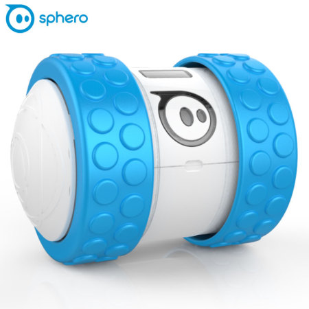

# Sphero Ollie



The Sphero Ollie, Sphero SPRK+, and Sphero BB-8 all use the same API. However,
they have separate Gobot drivers to accommodate their other differences.

## What you need

    - Sphero Ollie
    - Personal computer with Go installed, and a Bluetooth 4.0 radio.
    - Linux, macOS, or Windows

## Installation

Since this code uses the TinyGo Bluetooth package, you may have some specific installation requirements for your platform.

## Running the code

When you run any of these examples, you will compile and execute the code on your computer. When you are running the program, you will be communicating with the Ollie using the Bluetooth interface.

On Linux and Windows you will use the MAC address of the device to connect.

On macOS you must use the Bluetooth ID of the device to connect.

Therefore, you must know the correct name and then MAC address or ID for that robot in order to connect to it.

The number of the robot should be listed on the side of it. You can lookup the correct name/MAC address in the following table.

|Number|Name|MAC Address|
|------|----|-----------|
|1|2B-C09F|D1:FE:13:8D:C0:9F|
|2|2B-6603|C2:FC:CE:65:66:03|
|3|2B-5F6A|D6:5F:69:D6:5F:6A|
|4|2B-DE50|E0:4A:58:0C:DE:50|

To find out the unique Bluetooth ID assigned to that device from macOS, you can use the Bluetooth scanner located in the `tools/blescanner` directory of this repo:

```
cd tools
go run ./blescanner
```

Press "Control-C" to stop the `blescanner` program. 

## Code

### step1

This tests that the Sphero Ollie is connected correctly to your computer, by blinking the built-in LED.

```
go run ./step1/ [MAC address or Bluetooth ID]
```

Press "Control-C" to stop the program. 

### step2

Rolls around at random.

```
go run ./step2/ [MAC address or Bluetooth ID]
```

Press "Control-C" to stop the program. 

### step3

Rolls around at random and displays collision notifications from robot in your terminal.

```
go run ./step3/ [MAC address or Bluetooth ID]
```

Press "Control-C" to stop the program. 

### step4

Control robot using keyboard.

```
go run ./step4/ [MAC address or Bluetooth ID]
```

`w` - forward
`a` - left
`s` - backward
`d` - right
`ESC`, `CTRL-C` - exit

First press and release the ESC key, and then press "Control-C" to stop the program.

### step5

This step has us receiving a heartbeat signal from the "base station" using the MQTT machine to machine messaging protocol. No additional hardware needs to be connected.

You will need to install the Mosquitto MQTT client tools:

Linux - `sudo apt install -y mosquitto-clients`

macOS - `brew install mosquitto-clients`

Windows - `scoop install mosquitto`

You will need the server location of the MQTT server to use:

`tcp://test.mosquitto.org:1883`

When the heartbeat data is received from MQTT server, the built-in LED will change to a random color.

Run the following command to control your robot:

```
go run ./step5/ D6:5F:69:D6:5F:6A tcp://test.mosquitto.org:1883
```

First press and release the ESC key, and then press "Control-C" to stop the robot program. 

You can send data to all of the connected robots by running the following command:

`mosquitto_pub -h test.mosquitto.org -t tinygo/hacksession/heartbeat -m hello`

Note that you will need to do this while the robot program is running, from another terminal window.

### step6

Control robot using keyboard, receive data from server base station.

```
go run ./step6/ [MAC address or Bluetooth ID] tcp://test.mosquitto.org:1883
```

You can send data to all of the connected robots by running the following command:

`mosquitto_pub -h test.mosquitto.org -t tinygo/hacksession/heartbeat -m hello`

### step7

Control robot using keyboard, both receive data and also send collision data to server.

```
go run ./step7/ [MAC address or Bluetooth ID] tcp://test.mosquitto.org:1883
```

To see the data being sent from each robot you can run the following command:

`mosquitto_sub -h test.mosquitto.org -t tinygo/hacksession/collision/#`

## License

Copyright (c) 2015-2023 The Hybrid Group and friends. Licensed under the MIT license.
