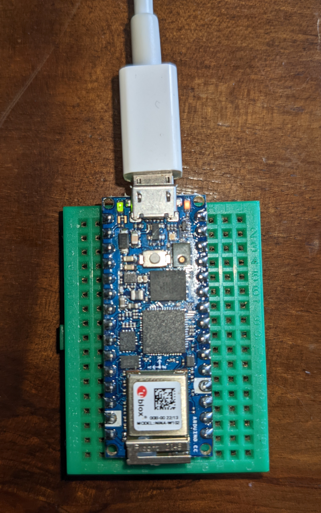
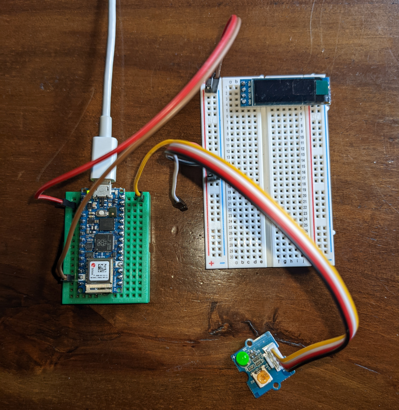
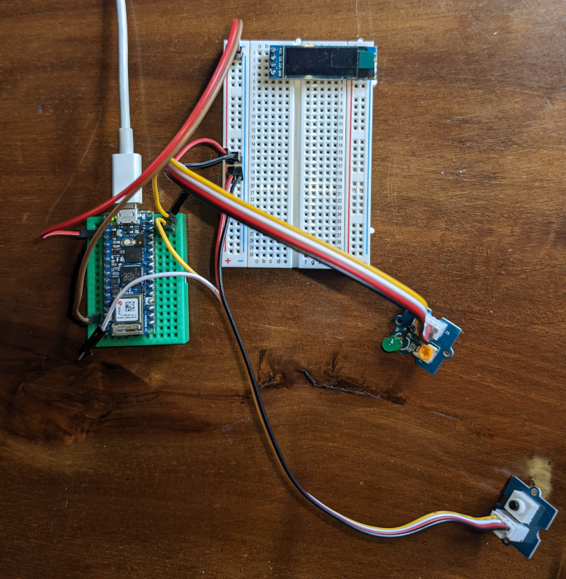
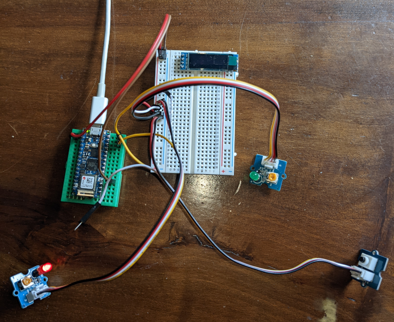
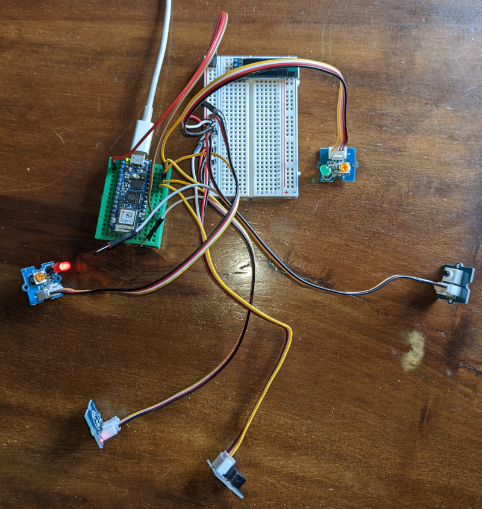
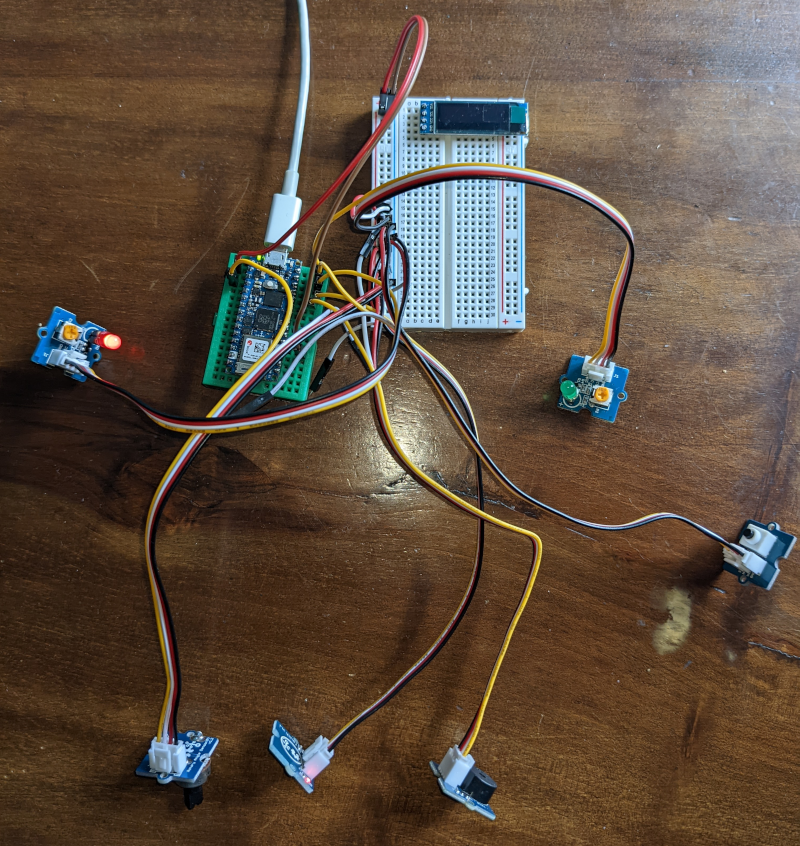
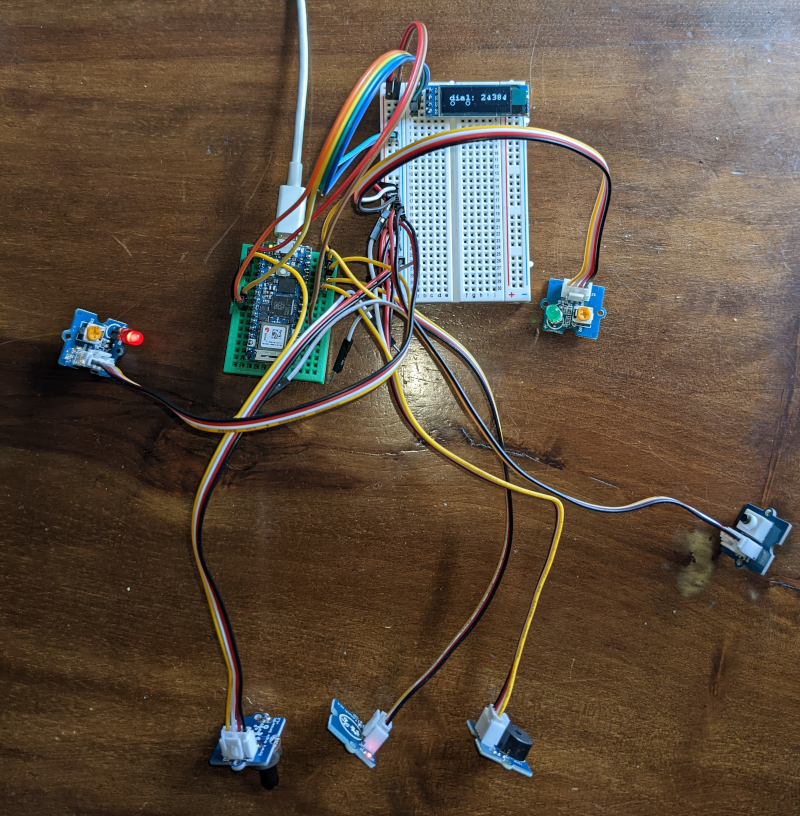

# Arduino Sensor Station

## What you need

    - Arduino Nano RP2040 Connect IoT board
    - Grove IoT Starter Kit parts
    - Personal computer with Go 1.18+ and TinyGo installed, and a serial port.

## Installation

### Go 1.18

If somehow you have not installed Go 1.18 on your computer already, you can download it here:

https://golang.org/dl/

Now you are ready to install TinyGo.

### TinyGo

Follow the instructions here for your operating system:

https://tinygo.org/getting-started/

### TinyGo drivers

The TinyGo drivers that let you connect to sensors, displays, and other external peripheral devices are located in the separate repository at

The driver and the other code dependencies are already in the Go modules file in this directory, so they will be downloaded and installed automatically.

## Connecting the Arduino to your computer


Plug the Arduino into your computer using a USB cable. There may be one provided in your starter kit.

## Running the code

The TinyGo programs will run directly on the Arduino's microcontoller. The procedure is basically:

- Edit your TinyGo program.
- Compile and flash it to your Arduino.
- The program executes from the Arduino. You can disconnect the Arduino from your computer and plug it into a battery if you wish, the program executes directly on the microcontroller.

Let's get started!

## Code

### step0.go - Built-in LED



This tests that you can compile and flash your Arduino with TinyGo code, by blinking the built-in LED.

Run the following command to compile your code, and flash it onto the Arduino:

```
tinygo flash -target nano-rp2040 ./step0/main.go
```

Once the Arduino is flashed correctly, the built-in amber LED to the right of the USB jack should start to turn on and off once per second. Now everything is setup correctly and you are ready to continue.


### step1.go - Blue LED



- Connect one of the "Ground" pins on the Arduino to the breadboard's ground rail (-) using a black or brown jumper cable.

- Connect the "3.3V" pin on the Arduino to the breadboard's power rail (+) using a red jumper cable.

- Plug the Grove blue LED into the provided cable with the Grove connector on one end, and the male jumpers on the other. Make sure the LED itself is plugged into the Grove board.

- Connect the black male end of the Grove cable to the breadboard's ground rail (-).

- Connect the red male end of the Grove cable to the breadboard's power rail (+).

- Connect the yellow male end of the Grove cable to pin D12 on the Arduino.

Run the code.

```
tinygo flash -target nano-rp2040 ./step1/main.go
```

You should see the blue LED blink.


### step2.go - Blue LED, Button



- Plug the Grove Button into a provided cable with the Grove connector on one end, and the male jumpers on the other.

- Connect the black male end of the Grove cable to the breadboard's ground rail (-).

- Connect the red male end of the Grove cable to the breadboard's power rail (+).

- Connect the yellow male end of the Grove cable to pin D11 on the Arduino.

Run the code.

```
tinygo flash -target nano-rp2040 ./step2/main.go
```

When you press the button, the blue LED should turn on.


### step3.go - Blue LED, Button, Green LED



- Plug the Grove green LED into one of the provided cable with the Grove connector on one end, and the male jumpers on the other.

- Connect the black male end of the Grove cable to the breadboard's top left set of pins (-).

- Connect the red male end of the Grove cable to the breadboard's top right (+) set of pins.

- Connect the yellow male end of the Grove cable to pin D10 on the Arduino.

Run the code.

```
tinygo flash -target nano-rp2040 ./step3/main.go
```

The green LED should light up. When you press the button, the blue LED should turn on, and the green LED should turn off. When you release the button, the blue LED should turn off, and the green LED should turn on again.

### step4.go - Blue LED, Button, Green LED, Buzzer, Touch



- Plug the Grove touch sensor into one of the provided cables with the Grove connector on one end, and the male jumpers on the other.

- Connect the black male end of the Grove cable to the breadboard's top left set of pins (-).

- Connect the red male end of the Grove cable to the breadboard's top right (+) set of pins.

- Connect the yellow male end of the Grove cable to pin D9 on the Arduino.

- Plug the Grove buzzer into one of the provided cables with the Grove connector on one end, and the male jumpers on the other.

- Connect the black male end of the Grove cable to the breadboard's top left set of pins (-).

- Connect the red male end of the Grove cable to the breadboard's top right (+) set of pins.

- Connect the yellow male end of the Grove cable to pin D8 on the Arduino.

Run the code.

```
tinygo flash -target nano-rp2040 ./step4/main.go
```

When you touch the touch sensor, the buzzer should emit a noise.


### step5.go - Blue LED, Button, Green LED, Buzzer, Touch, Dial



- Plug the Grove dial (Rotary Angle Sensor) into one of the provided cables with the Grove connector on one end, and the male jumpers on the other.

- Connect the black male end of the Grove cable to the breadboard's top left set of pins (-).

- Connect the red male end of the Grove cable to the breadboard's top right (+) set of pins.

- Connect the yellow male end of the Grove cable to pin A0 on the Arduino.

```
tinygo flash -target nano-rp2040 ./step5/main.go
```

Adjusting the dial sensor should control the brightness of the green LED.


### step6.go - Blue LED, Button, Green LED, Buzzer, Touch, Dial, OLED



- Connect a jumper wire from the "GND" pin on the breadboard next to the OLED display, to the breadboard's top left set of pins (-).

- Connect a jumper wire from the "VCC" pin on the breadboard next to the OLED display, to the breadboard's top right (+) set of pins.

- Connect a jumper wire from the "SCL" pin on the breadboard next to the OLED display, to the Arduino Nano33's A5 pin.

- Connect a jumper wire from the "SDA" pin on the breadboard next to the OLED display, to the Arduino Nano33's A4 pin.


```
tinygo flash -target nano-rp2040 ./step6/main.go
```

The dial should now case the OLED display to its current position. The OLED should also have two empty circles that will light up when you press the Button to light up the Blue LED and when you press the touch sensor respectively.


### step7.go - Blue LED, Button, Green LED, Buzzer, Touch, Dial, MQTT


In this step we will connect to a machine to machine messaging server using the MQTT protocol. No additional hardware is required for this step.

Substitute the correct values for your WiFi setup in the following command:

```
tinygo flash -target nano-rp2040 -ldflags="-X main.ssid=MYSSID -X main.pass=MYPASS" ./step7/main.go
```

How to tell if it is working...

```
mosquitto_sub -h 'test.mosquitto.org' -t 'tinygo'
```

When you run this command, you should be able to see the messages appear from your own machine when you press the button.
